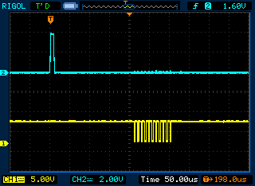
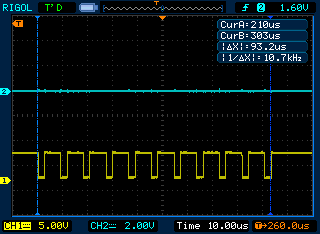
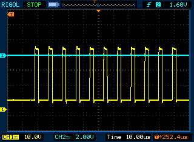
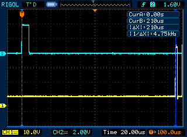
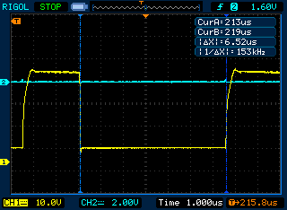
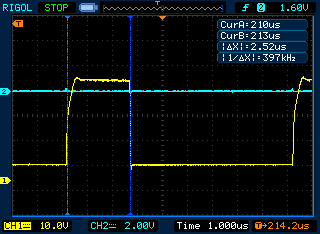
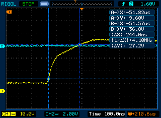
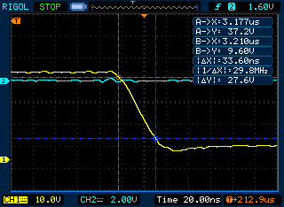

# solid-state-laser-modulator-control-unit

## Description

This repository contains the circuit and code of the control unit of the Q-factor modulator of a solid-state laser based on the Atmega 328p microcontroller embedded in Arduino.

## What is a Q-factor modulator for?

The laser without a Q-factor modulator operates in continuous mode. But some lasers, such as ruby, cannot work in this mode due to heating, and as a result, damage to the material.  Such lasers can only be used in pulsed mode. To create such a laser operation mode, Q-factor modulation is necessary. The essence of the process is that during pumping, the properties of the optical resonator are intentionally "degraded", thus preventing the laser from emitting. Due to this, the power is not spent on radiation and it is possible to obtain a high level of inverse population of the energy levels of the active medium. Further, the properties of the resonator are quickly "improved", and all the accumulated energy is realized in the form of a short, powerful pulse. To control these properties of the optical resonator, a Q-factor modulator control unit is needed, which creates control pulses.

## Technical specifications

- Start delay time of the first control pulse $t_d = 210\,\mu s$
- Duration of the control pulse $t_p = 2.6\,\mu s$;
- The duration of the leading edge of the pulse $t_f \le 0.3\,\mu s$
- The duration of the rear edge of the pulse $t_b \le 0.4\,\mu s$
- The amplitude of the control pulse on the load $U_m = 34\,V$
- The number of pulses in the series – 11
- Pulse repetition period $T = 0.1\,\mu s$
- Load resistance $R_l = 5\,k\Omega$
- Load capacity $C_l = 50\,pF$

*place for the pulses scheme*

The Arduino UNO hardware platform based on the Atmega 328p 8-bit microcontroller was chosen to perform this task. The control unit consists of only two components: a microcontroller (processes an external signal and generates pulses) and a power amplifier.

## Description of the progam [main.asm](src/main.asm)

- Configure the ports: PD7 for output, the rest for input
- Set 1 to PD7
- Check the PD5 for a signal (until a signal appears)
- If there is a signal, then pulse generation is started: set 0 to PD7, wait 2.6 microseconds, set 1, wait 6.5 microseconds
- Check the PD5 for the absence of a signal (until the signal disappears)
- Return to checking for the presence of a signal.

PD7 and PD5 are 7 and 5 pins on the Arduino board, respectively.
The program generates inverted pulses, since there will be a transistor switch at the output that inverts the signal.

## Calculation of the transistor key

A transistor switch is used as a power amplifier in this work. I used a soviet NPN transistor KT603V (КТ603В).

*place for key scehme*

*place for key calculation*

## Results

### Without amplifier





### With amplifier














### Accuracy of the characteristics of the received pulses

$\Delta t_d = \frac{210 - 210}{210} = 0\% < 10\%$

$\Delta t_p = \frac{2.6 - 2.52}{2.6} = 3.07\% < 10\%$

$\Delta T = \frac{9.1 - 9.04}{9.1} = 0.67\% < 10\%$

$t_f = 0.244\,\mu s < 0.3\,\mu s$

$t_b = 0.034\,\mu s < 0.4\,\mu s$

## Arduino adjust

```cmd
%ArduinoIDEPath%\hardware\tools\avr\bin\avrdude.exe -C "%ArduinoIDEPath%\hardware\tools\avr\etc\avrdude.conf" -p atmega328p -c arduino -P COM4 -b 115200 -U flash:w:"$(ProjectDir)Debug\$(TargetName).hex":i
```